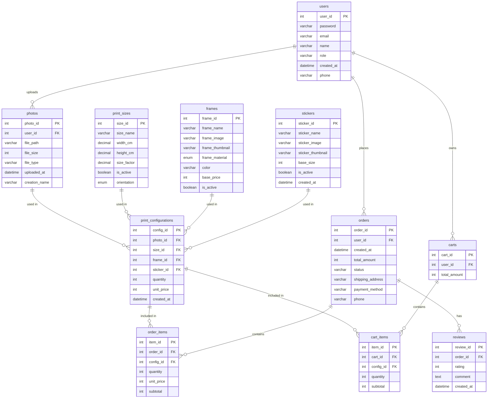

# Database Design – Photo Printing System

This document describes the database structure of the Photo Printing system, including the Entity Relationship Diagram (ERD) and detailed table specifications.

---

## Entity Relationship Diagram (ERD)

---

## Table Overview

| Table | Fields | Description |
|---|---|---|
| **Users** | user_id (PK), name, email, password, role, created_at, phone | Stores system user accounts, including customers who order photo prints and administrators. This information is used for login, authorization, and user management. |
| **Photos** | photo_id (PK), user_id (FK), file_path, file_size, file_type, uploaded_at, creation_name | Stores the photos uploaded by customers to the system for use in printing. |
| **Frames** | frame_id (PK), frame_name, frame_material, color, base_price, is_active, frame_image, frame_thumbnail | Stores the list of frame types that customers can select when printing photos. |
| **Print_Sizes** | size_id (PK), size_name, width_cm, height_cm, base_price, is_active, orientation | Stores the available print sizes in the system, used during print customization and price calculation. |
| **Stickers** | sticker_id (PK), sticker_name, sticker_image, sticker_thumbnail, base_size, is_active, created_at | Stores decorative stickers, including name, image, size, active status, and creation date. |
| **Print_Configurations** | config_id (PK), photo_id (FK), size_id (FK), frame_id (FK), sticker_id (FK), quantity, unit_price, created_at | Stores the print configuration selected by the customer after viewing the preview. |
| **Orders** | order_id (PK), user_id (FK), created_at, total_amount, status, shipping_address, phone, payment_method | Stores the customer's photo print order information. |
| **Order_Items** | item_id (PK), order_id (FK), config_id (FK), quantity, unit_price, subtotal | Stores the details of each print configuration within a specific order. Each record corresponds to one printed photo in the order. |
| **Reviews** | review_id (PK), order_id (FK), rating, comment, created_at | Stores the customer's rating and comments after an order is completed. |
| **Carts** | cart_id (PK), user_id (FK), total_amount | Stores the customer's shopping cart. |
| **Cart_Items** | item_id (PK), config_id (FK), cart_id (FK), quantity, subtotal | Stores the print configuration for each line item in the customer's cart. |

---

## Table Specifications

### 1. `users`

| Field | Type | Constraint | Description |
|---|---|---|---|
| user_id | int | Primary Key | Unique identifier for each user |
| password | varchar(20) | Not null | User's login password |
| email | varchar(150) | Not null | Registration email, used for login |
| name | varchar(255) | Not null | User's full name |
| role | varchar(20) | Not null | User role (customer / admin) |
| phone | varchar(20) | – | User's contact phone number |
| created_at | datetime | Not null | Record creation timestamp |

### 2. `photos`

| Field | Type | Constraint | Description |
|---|---|---|---|
| photo_id | int | Primary Key | Unique identifier for the photo |
| user_id | int | Foreign Key | Reference to the user who owns the photo |
| file_path | varchar(255) | Not null | Storage path of the photo |
| file_size | int | – | File size of the photo |
| file_type | varchar(20) | – | Photo format (jpg, png, etc.) |
| creation_name | varchar(255) | – | Stored display name of the photo |
| uploaded_at | datetime | Not null | Timestamp when the photo was uploaded |

### 3. `frames`

| Field | Type | Constraint | Description |
|---|---|---|---|
| frame_id | int | Primary Key | Unique identifier for the frame |
| frame_name | varchar(255) | Not null | Name of the frame |
| frame_image | varchar(255) | – | Path to the full-size frame image |
| frame_thumbnail | varchar(255) | – | Path to the frame's thumbnail image |
| frame_material | enum ('canvas','acrylic','plastic') | Not null | Material of the frame |
| color | varchar(50) | – | Color of the frame |
| base_price | int | Not null | Base price of the frame (VND) |
| is_active | boolean | Default(1) | Whether the frame is currently available |

### 4. `print_sizes`

| Field | Type | Constraint | Description |
|---|---|---|---|
| size_id | int | Primary Key | Unique identifier for the print size |
| size_name | varchar(50) | Not null | Name of the print size |
| width_cm | decimal(5,2) | Not null | Print width (cm) |
| height_cm | decimal(5,2) | Not null | Print height (cm) |
| size_factor | decimal(4,1) | – | Pricing factor based on print size |
| is_active | boolean | Default(1) | Whether the size is currently available |
| orientation | enum ('horizontal','vertical') | Not null | Frame orientation |

### 5. `stickers`

| Field | Type | Constraint | Description |
|---|---|---|---|
| sticker_id | int | Primary Key | Unique identifier for the sticker |
| sticker_name | varchar(255) | Not null | Name of the sticker |
| sticker_image | varchar(255) | – | Path to the full-size sticker image |
| sticker_thumbnail | varchar(255) | – | Path to the sticker's thumbnail image |
| base_size | int | – | Base size of the sticker |
| is_active | boolean | Default(1) | Whether the sticker is currently available |
| created_at | datetime | Not null | Timestamp when the sticker was created |

### 6. `print_configurations`

| Field | Type | Constraint | Description |
|---|---|---|---|
| config_id | int | Primary Key | Unique identifier for the print configuration |
| photo_id | int | Foreign Key | Reference to the photo being printed |
| size_id | int | Foreign Key | Reference to the selected print size |
| frame_id | int | Foreign Key | Reference to the selected frame |
| sticker_id | int | Foreign Key | Reference to the selected sticker |
| quantity | int | Not null | Number of prints |
| unit_price | int | Not null | Price per print for this configuration |
| created_at | datetime | Not null | Timestamp when the configuration was created |

### 7. `orders`

| Field | Type | Constraint | Description |
|---|---|---|---|
| order_id | int | Primary Key | Unique identifier for the order |
| user_id | int | Foreign Key | Reference to the user who placed the order |
| total_amount | int | Not null | Total order amount (VND) |
| status | varchar(20) | Not null | Order processing status |
| shipping_address | varchar(255) | Not null | Delivery address |
| payment_method | varchar(30) | Not null | Payment method |
| phone | varchar(20) | Not null | Contact phone number |
| created_at | datetime | Not null | Timestamp when the order was created |

### 8. `order_items`

| Field | Type | Constraint | Description |
|---|---|---|---|
| item_id | int | Primary Key | Unique identifier for the order line item |
| order_id | int | Foreign Key | Reference to the order |
| config_id | int | Foreign Key | Reference to the print configuration |
| quantity | int | Not null | Number of prints |
| unit_price | int | Not null | Price per print |
| subtotal | int | Not null | Total amount for this line item |

### 9. `reviews`

| Field | Type | Constraint | Description |
|---|---|---|---|
| review_id | int | Primary Key | Unique identifier for the review |
| order_id | int | Foreign Key | Reference to the order being reviewed |
| rating | int | Not null | Customer rating (1–5) |
| comment | text | – | Review comment |
| created_at | datetime | Not null | Timestamp when the review was submitted |

### 10. `carts`

| Field | Type | Constraint | Description |
|---|---|---|---|
| cart_id | int | Primary Key | Unique identifier for the cart |
| user_id | int | Foreign Key | Reference to the customer who owns the cart |
| total_amount | int | Not null | Total amount of items in the cart (VND) |

### 11. `cart_items`

| Field | Type | Constraint | Description |
|---|---|---|---|
| item_id | int | Primary Key | Unique identifier for the cart line item |
| cart_id | int | Foreign Key | Reference to the cart |
| config_id | int | Foreign Key | Reference to the print configuration |
| quantity | int | Not null | Number of prints |
| subtotal | int | Not null | Total amount for this line item |

---

## Table Relationships

- One **user** can upload multiple **photos** (1-to-many).
- One **user** can place multiple **orders** (1-to-many).
- One **user** can own one **cart** (1-to-many, modeled as one active cart per user).
- One **photo** can be used in multiple **print_configurations** (1-to-many).
- One **print_size** can be used in multiple **print_configurations** (1-to-many).
- One **frame** can be used in multiple **print_configurations** (1-to-many).
- One **sticker** can be used in multiple **print_configurations** (1-to-many).
- One **print_configuration** can appear in multiple **order_items** and/or **cart_items** (1-to-many).
- One **order** can contain multiple **order_items** (1-to-many).
- One **order** can have multiple **reviews** (1-to-many).
- One **cart** can contain multiple **cart_items** (1-to-many).
