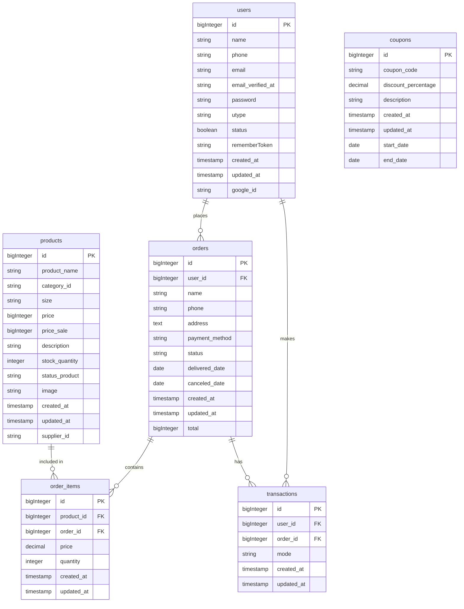

# Database Design – INTROWEAR

This document describes the database structure of the INTROWEAR system, including the Entity Relationship Diagram (ERD) and detailed table specifications.

---

## Entity Relationship Diagram (ERD)

---

## Table Specifications

### 1. `users`

| Field | Type | Constraint | Description |
|---|---|---|---|
| id | bigInteger | Primary Key | Auto-increment user ID |
| phone | string | Not null - Unique | User's phone number (unique) |
| name | string | Not null | User's full name |
| email | string | Not null - Unique | User's email address (unique) |
| google_id | string | Unique | Google account ID |
| email_verified_at | timestamp | – | Time when the email address was verified |
| password | string | Not null | User password |
| status | boolean | Default(1) | Account status: 1 (active), 0 (inactive/disabled) |
| utype | string | Default(USR) | User type: USR (customer), ADM (administrator) |
| rememberToken | string | – | Token used for the "Remember Me" feature |
| created_at | timestamp | Not null | Record creation timestamp |
| updated_at | timestamp | Not null | Last update timestamp |

### 2. `products`

| Field | Type | Constraint | Description |
|---|---|---|---|
| id | bigInteger | Primary Key | Unique product ID |
| product_name | string | Not null | Product name |
| category_id | string | Not null | Product category ID |
| size | string | Not null | Product size |
| price | bigInteger | Not null | Original price |
| price_sale | bigInteger | – | Discounted price |
| description | string | Not null | Product description |
| stock_quantity | integer | Not null | Available stock quantity |
| status_product | enum ('In Stock','Out of Stock') | Not null | Product availability status |
| supplier_id | string | – | Supplier ID |
| image | string | Not null | Product image filename |
| created_at | timestamp | Not null | Record creation timestamp |
| updated_at | timestamp | Not null | Last update timestamp |

### 3. `orders`

| Field | Type | Constraint | Description |
|---|---|---|---|
| id | bigInteger | Primary Key | Unique order ID |
| user_id | bigInteger | Foreign Key | Reference to the user who placed the order |
| total | bigInteger | Not null | Total order amount |
| name | string | Not null | Recipient's name |
| phone | string | Not null | Recipient's phone number |
| address | text | Not null | Shipping address |
| payment_method | enum('cod','card','paypal') | Not null | Payment method |
| status | enum('ordered','delivered','canceled') | Default('ordered') | Order status |
| delivered_date | date | – | Delivery date (if delivered) |
| canceled_date | date | – | Cancellation date (if canceled) |
| created_at | timestamp | Not null | Record creation timestamp |
| updated_at | timestamp | Not null | Last update timestamp |

### 4. `order_items`

| Field | Type | Constraint | Description |
|---|---|---|---|
| id | bigInteger | Primary Key | Unique order item ID |
| product_id | bigInteger | Foreign Key | Reference to the product |
| order_id | bigInteger | Foreign Key | Reference to the order |
| price | decimal | Not null | Product price at the time of purchase |
| quantity | integer | Not null | Quantity ordered |
| created_at | timestamp | Not null | Record creation timestamp |
| updated_at | timestamp | Not null | Last update timestamp |

### 5. `transactions`

| Field | Type | Constraint | Description |
|---|---|---|---|
| id | bigInteger | Primary Key | Unique transaction ID |
| user_id | bigInteger | Foreign Key | Reference to the user who made the transaction |
| order_id | bigInteger | Foreign Key | Reference to the related order |
| mode | enum('cod','card','paypal') | Not null | Payment method |
| created_at | timestamp | Not null | Record creation timestamp |
| updated_at | timestamp | Not null | Last update timestamp |

### 6. `coupons`

| Field | Type | Constraint | Description |
|---|---|---|---|
| id | bigInteger | Primary Key | Unique coupon ID |
| coupon_code | string | Not null | Coupon code |
| discount_percentage | decimal(5,2) | – | Discount percentage |
| start_date | date | Not null | Start date |
| end_date | date | Not null | Expiration date |
| description | string | Not null | Coupon description |
| created_at | timestamp | Not null | Record creation timestamp |
| updated_at | timestamp | Not null | Last update timestamp |

---

## Table Relationships

- One **user** can place multiple **orders** (1-to-many).
- One **order** can contain multiple **order_items** (1-to-many).
- One **product** can appear in multiple **order_items** (1-to-many).
- One **order** can have multiple **transactions** (1-to-many).
- One **user** can make multiple **transactions** (1-to-many).
