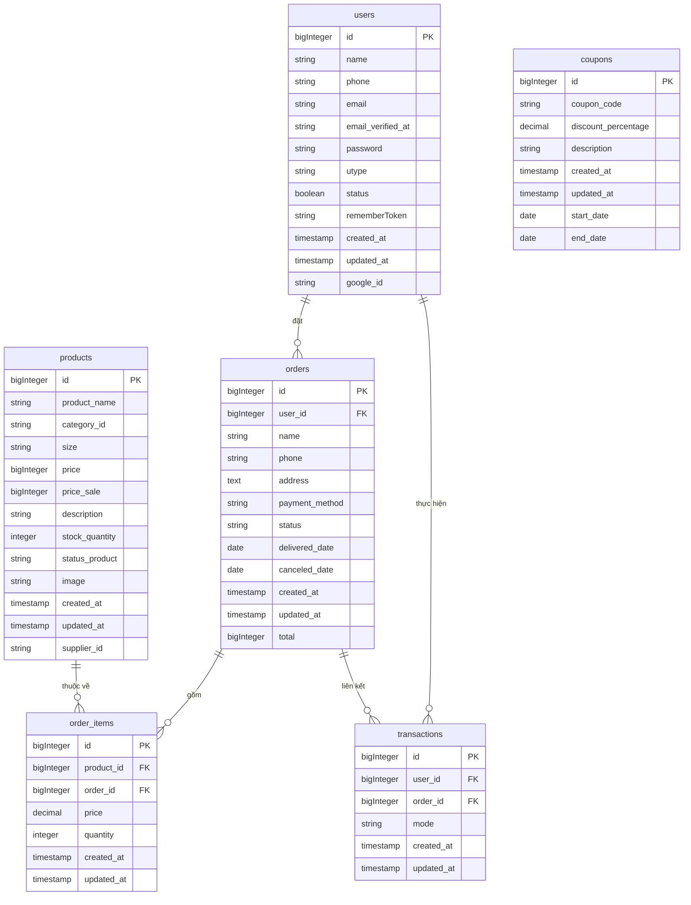

# Thiết kế Cơ sở dữ liệu – INTROWEAR

Tài liệu mô tả cấu trúc cơ sở dữ liệu của hệ thống INTROWEAR, bao gồm sơ đồ ERD và đặc tả chi tiết từng bảng.
---

## Sơ đồ ERD (Entity Relationship Diagram)

---

## Đặc tả chi tiết các bảng

### 1. `users`

| Field | Type | Constraint | Description |
|---|---|---|---|
| id | bigInteger | Primary Key | User ID, tự tăng |
| phone | string | Not null - Unique | Số điện thoại người dùng (duy nhất) |
| name | string | Not null - Unique | Tên người dùng (duy nhất) |
| email | string | Not null - Unique | Địa chỉ email của người dùng (duy nhất) |
| google_id | string | Unique | Mã định danh Google (duy nhất) |
| email_verified_at | timestamp | – | Thời gian email được xác minh |
| password | string | Not null | Mật khẩu |
| status | boolean | Default(1) | Trạng thái hoạt động: 1 (hoạt động), 0 (đã khóa/vô hiệu hóa) |
| utype | string | Default(USR) | Loại người dùng: USR (thường), ADM (quản trị viên) |
| rememberToken | string | – | Token dùng để ghi nhớ đăng nhập |
| created_at | timestamp | Not null | Ngày giờ tạo người dùng |
| updated_at | timestamp | Not null | Ngày giờ cập nhật cuối cùng |

### 2. `products`

| Field | Type | Constraint | Description |
|---|---|---|---|
| id | bigInteger | Primary Key | Mã định danh duy nhất của sản phẩm |
| product_name | string | Not null | Tên sản phẩm |
| category_id | string | Not null | Mã danh mục sản phẩm |
| size | string | Not null | Kích cỡ của sản phẩm |
| price | bigInteger | Not null | Giá gốc của sản phẩm |
| price_sale | bigInteger | – | Giá khuyến mãi |
| description | string | Not null | Mô tả chi tiết về sản phẩm |
| stock_quantity | integer | Not null | Số lượng tồn kho của sản phẩm |
| status_product | enum ('Còn hàng','Hết hàng') | Not null | Trạng thái hiện tại của sản phẩm |
| supplier_id | string | – | Mã nhà cung cấp |
| image | string | Not null | Tên file ảnh đại diện của sản phẩm |
| created_at | timestamp | Not null | Ngày giờ thêm sản phẩm |
| updated_at | timestamp | Not null | Ngày giờ cập nhật cuối cùng |

### 3. `orders` 

| Field | Type | Constraint | Description |
|---|---|---|---|
| id | bigInteger | Primary Key | Mã định danh duy nhất cho đơn hàng |
| user_id | bigInteger | Foreign Key | Mã người dùng |
| total | bigInteger | Not null | Tổng số tiền của đơn hàng |
| name | string | Not null | Tên người nhận hàng |
| phone | string | Not null | Số điện thoại liên hệ khi giao hàng |
| address | text | Not null | Địa chỉ giao hàng |
| payment_method | enum('cod','card','paypal') | Not null | Phương thức thanh toán |
| status | enum('ordered','delivered','canceled') | Default('ordered') | Trạng thái đơn hàng |
| delivered_date | date | – | Ngày giao hàng thành công (nếu có) |
| canceled_date | date | – | Ngày đơn hàng bị hủy (nếu có) |
| created_at | timestamp | Not null | Thời điểm tạo đơn hàng |
| updated_at | timestamp | Not null | Thời điểm cập nhật đơn hàng gần nhất |

### 4. `order_items`

| Field | Type | Constraint | Description |
|---|---|---|---|
| id | bigInteger | Primary Key | Mã định danh duy nhất của chi tiết đơn hàng |
| product_id | bigInteger | Foreign Key | Mã sản phẩm |
| order_id | bigInteger | Foreign Key | Mã đơn hàng |
| price | decimal | Not null | Giá tại thời điểm đặt hàng |
| quantity | integer | Not null | Số lượng sản phẩm |
| created_at | timestamp | Not null | Ngày giờ thêm chi tiết |
| updated_at | timestamp | Not null | Ngày giờ cập nhật cuối cùng |

### 5. `transactions`

| Field | Type | Constraint | Description |
|---|---|---|---|
| id | bigInteger | Primary Key | Mã định danh duy nhất của giao dịch thanh toán |
| user_id | bigInteger | Foreign Key | Mã người dùng thực hiện giao dịch |
| order_id | bigInteger | Foreign Key | Mã đơn hàng tương ứng với giao dịch |
| mode | enum('cod','card','paypal') | Not null | Hình thức thanh toán |
| created_at | timestamp | Not null | Ngày giờ giao dịch được tạo |
| updated_at | timestamp | Not null | Ngày giờ cập nhật cuối cùng |

### 6. `coupons`

| Field | Type | Constraint | Description |
|---|---|---|---|
| id | bigInteger | Primary Key | Mã định danh duy nhất của mã giảm giá |
| coupon_code | string | Not null | Mã giảm giá |
| discount_percentage | decimal(5,2) | – | Phần trăm giảm giá áp dụng |
| start_date | date | Not null | Ngày bắt đầu hiệu lực |
| end_date | date | Not null | Ngày hết hạn |
| description | string | Not null | Mô tả mã giảm giá |
| created_at | timestamp | Not null | Thời điểm tạo mã giảm giá |
| updated_at | timestamp | Not null | Thời điểm cập nhật cuối cùng |

---

## 🔗 Quan hệ giữa các bảng

- Một **user** có thể có nhiều **orders** (1-n)
- Một **order** có thể có nhiều **order_items** (1-n)
- Một **product** có thể xuất hiện trong nhiều **order_items** (1-n)
- Một **order** có thể có nhiều **transactions** ghi nhận giao dịch (1-n)
- Một **user** có thể thực hiện nhiều **transactions** (1-n)
